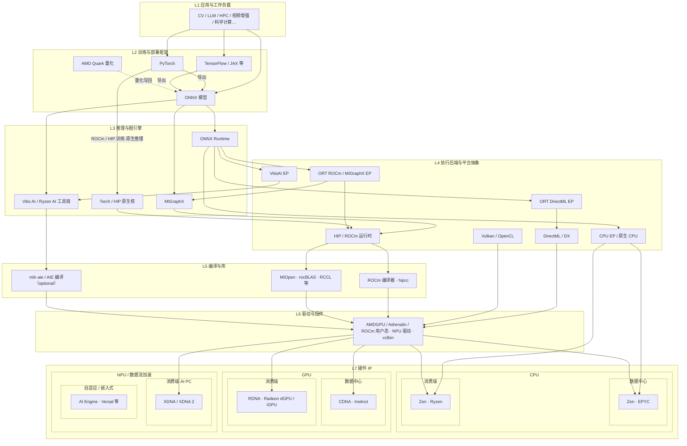

> 最近在玩 AI 动画生成，但是剪辑软件里的超分、插帧要会员，笔者只有一台 thinkbook 14+ AMD 8845H 可用，有可用的 780M 核显还有 Ryzen AI NPU，同时有14G的共享内存。但是常用的开源软件没有支持 NPU，因此想着写一个 GPU + NPU 协同推理来加速视频增强流程。

> 2026.7.12: 可惜 windows / wsl 的原生支持都不够好，效果差强人意（

## 1. 视频插帧与超分

### 1.1 问题定义

**视频帧插值（Video Frame Interpolation, VFI）** 的目标是：给定相邻帧 $I_0$、$I_1$，合成中间时刻 $t\in(0,1)$ 的帧 $I_t$，使时间轴更密、运动更连贯。形式上看，模型学习映射

$$
f_\theta:(I_0,I_1,t)\mapsto I_t
$$

其中 \(t=0.5\) 的「插一帧」最常见；任意 \(t\) 则支持更细的时间采样或可变慢动作。应用场景包括：影视与动画的帧率提升（如 24/30 fps → 48/60 fps）、体育与监控的慢动作生成、直播或采集链路中的丢帧补偿，以及近重复照片之间的「伪视频」过渡。

**视频超分（Super-Resolution, SR）** 的目标是：从低分辨率 $I_{LR}$ 恢复更高分辨率的 $I_{HR}$。单个图片 SR 只看空间；视频 SR 还要处理压缩伪影、噪声与**帧间一致性**（同一纹理在相邻帧不能闪烁）。尺度因子常见为 ×2 / ×4；动漫内容往往需要专用权重。

工程上常把插帧与超分串成增强流水线：

- **先插帧再超分**：中间帧在低分辨率上生成，算力峰值相对可控，但超分要处理更多帧；
- **先超分再插帧**：运动估计在高分辨率上进行，细节更丰富，但插帧的显存与带宽压力上升。

### 1.2 负载特征

从系统视角看，这两类负载有以下负载特征：

| 维度       | 插帧 (VFI)                              | 超分 (SR)                               |
| ---------- | --------------------------------------- | --------------------------------------- |
| 输入形态   | 成对（或更多）帧，强时序依赖            | 单帧为主；视频 SR 可加时序模块          |
| 算子形态   | 光流 / 运动估计 + warp + 融合           | 深层卷积 / RRDB 特征提取 + 上采样       |
| 访存特征   | 大分辨率特征图反复读写；warp 不规则访存 | 卷积规则但通道深；tile 时边界重叠       |
| 形状约束   | 常需对齐到 32/64 倍数                   | NPU 友好时常固定 tile（如 256²、512²）  |
| 并行粒度   | 帧对流水；阶段间可拆 EP                 | 空间 tile 并行；body / upsample 可拆 EP |
| 质量敏感点 | 遮挡、大位移、细结构闪烁                | 伪纹理、振铃、压缩块效应                |
| 典型瓶颈   | 带宽 + 不规则采样                       | 算力 + 激活显存                         |

1. **运动估计与特征提取**：规则卷积，算术强度高，适合吞吐型加速器；但若分辨率随输入变化，编译型 NPU 会吃亏。
2. **Warp / grid sample**：gather 型访存，缓存命中差，GPU 纹理单元或通用加载更合适，NPU 的固定数据流往往不划算。
3. **视频 I/O 与色彩空间转换**：应使用 CPU / 专用编解码硬件加速。
4. **时间局部性**：插帧必须按帧对顺序推进（或维护滑动窗口），而超分的 tile 在空间上可并行。在超分上更容易通过 tile 流水实现 GPU + NPU 协同；而在插帧上表现为流水线重叠。

### 1.3 插帧原理

在深度学习之前，视频插值往往依赖经典光流估计，再做沿流场的重采样。光流把「亮度恒定 + 平滑」等假设写成优化问题，优点是可解释，缺点是大位移、遮挡与纹理缺失处容易碎。深度学习并没有取消光流这个概念，而是把「估流 / warp / 融合」里越来越多的步骤变成可学习模块，并在数据上直接对最终帧监督。

经典深度管线概括为三步：

1. **运动估计**：求 $I_0\leftrightarrow I_1$ 的光流，或直接估计指向中间时刻的中间流；
2. **运动补偿（warp）**：把输入帧按流场采样到 $t$；
3. **融合 / 合成**：处理遮挡与多源冲突，生成 $I_t$。

**RIFE（Real-Time Intermediate Flow Estimation）**：用 IFNet（神经网络模块） **直接估计中间光流**。教师可访问真实中间帧以产生更稳的中间流监督；学生仅以 $I_0$、$I_1$ 及 $t$ 为输入，在训练中对齐教师输出，推理时只部署学生。

RIFE 实时性好且较稳定，是目前大量工程实现（如 [rife-ncnn-vulkan](https://github.com/nihui/rife-ncnn-vulkan) ）的默认选择。

### 1.4 超分原理

#### SRCNN

**SRCNN** 把传统稀疏编码超分的「特征提取—非线性映射—重建」重写为三层卷积，证明深度学习可以端到端学习 LR→HR 映射，并以轻量结构超过当时的稀疏编码基线。

#### Real-ESRGAN

很多超分模型只在「理想缩小」的合成数据上训练，落到真实照片/视频上容易假、不自然。**Real-ESRGAN** 的核心是：在训练时尽量模拟真实世界里常见的变糊、变噪、再压缩等过程，让网络学会从「看起来像真低清」的图恢复高清；生成器沿用 ESRGAN 一类感知超分结构，并提供自然图、动漫等不同权重。

从实现角度看，Real-ESRGAN 推理还有几个工程要点：

- **Tile**：高分辨率输入无法整图进显存时，按块推理再拼接；块边界需要 overlap。

### 1.5 工程栈

研究原型多在 PyTorch / TensorFlow。落到可分发工具，常见路径是：

1. **导出**：ONNX、ncnn param/bin、TensorRT engine 等；
2. **运行时**：ncnn、ONNX Runtime、DirectML、Vulkan compute 等；
3. **编排**：解码 → 预处理 → 推理队列 → 后处理 → 编码。

一些开源工程：

| 项目                                                          | 角色                           |
| ------------------------------------------------------------- | ------------------------------ |
| [Video2X](https://github.com/k4yt3x/video2x)                  | 插帧 + 超分统一框架            |
| [ncnn](https://github.com/Tencent/ncnn)                       | 移动端优化的高性能推理框架     |
| [rife-ncnn-vulkan](https://github.com/nihui/rife-ncnn-vulkan) | RIFE 的 ncnn+Vulkan 实现       |
| [Real-ESRGAN](https://github.com/xinntao/Real-ESRGAN)         | 模型、权重与推理脚本           |
| [Flowframes](https://github.com/n00mkrad/flowframes)          | Windows GUI，封装 DAIN/RIFE 等 |

---

## 2. AMD 软硬件栈

### 2.1 完整分层图

AMD 软硬件栈分层（应用 → 框架 → 引擎 → 平台抽象 → 编译库 → 驱动 → Zen/RDNA/CDNA/XDNA/AIE）：

三种平台的部署方式：

_图：Linux+ROCm（CDNA）、Windows AI PC（RDNA+XDNA）、Vitis/AIE_

开源与文档入口：

| 组件                                                       | 角色                                |
| ---------------------------------------------------------- | ----------------------------------- |
| [ROCm](https://www.amd.com/en/products/software/rocm.html) | 数据中心与 Radeon+ROCm 的开放软件栈 |
| [MIGraphX](https://github.com/ROCm/AMDMIGraphX)            | GPU 图优化与推理引擎                |
| [Vitis-AI](https://github.com/Xilinx/Vitis-AI)             | NPU / AIE 工具与示例总入口之一      |
| [mlir-aie](https://github.com/Xilinx/mlir-aie)             | AI Engine 的 MLIR 编译基础设施      |
| [Quark](https://github.com/amd/quark)                      | AMD 模型量化库                      |

---

## 3. Windows 上的协同推理实验：`video4x`

实验实现位于 [MaintainAll](https://github.com/royenheart/MaintainAll/) 的 `apps/video4xinterpolation`（安装名 / Python 包：`video4x`）。目标是在 **Windows + Ryzen AI 软件栈**上，把 **RIFE 插帧**与 **Real-ESRGAN 超分**做成可单独或串联的算子，默认用 **GPU（DirectML）+ NPU（VitisAI）** 协同。

默认运行环境是 [ryzen AI](https://www.amd.com/zh-cn/products/software/ryzen-ai-software.html) 软件安装的 conda `ryzen-ai-1.7.1` 环境（带 VitisAI 与 DirectML 相关组件）。

Windows GPU 路径依赖 DirectML 相关 ORT 构建。需要将公开的 RIFE / Real-ESRGAN 权重导出。

### 3.1 总体架构

_图：运作流程_

分层对应代码如下：

| 层       | 模块                                       | 职责                       |
| -------- | ------------------------------------------ | -------------------------- |
| 任务编排 | `video4x.job.pipeline`                     | `EnhancePipeline` 串联算子 |
| 插帧算子 | `ops.interpolate` → `RifeInferenceEngine`  | 2× 插帧、固定档绑定        |
| 超分算子 | `ops.superresolve`                         | tile、导出、SR backend     |
| 运行时   | `runtime.backends`、`session`、`_ep_probe` | EP 探测、session、registry |
| 量化     | `quant.quark_quant`                        | 量化模型导出               |

### 3.2 插帧：RIFE v4.26

#### 3.2.1 导出

模型侧使用 Practical-RIFE v4.26 权重，导出时拆成：

- **Stage A**（`rife_stage_encode_block01.onnx`）：编码与早期 block，产出 flow、mask、特征与 warp 相关中间张量；
- **Stage B**（`rife_stage_block234.onnx`）：后续 block，融合得到中间帧；

并导出固定档（对 720p / 1080p 做 32 对齐）**736×1280**、**1088×1920**，落在 `models/onnx/fixed/<HxW>/`。推理前将帧 pad 到 32 的倍数，再绑定最接近的固定档 ONNX。

#### 3.2.2 `split-pipeline`

Windows 上 `SplitPipelineBackend` 的完整流程（机制 + 算法）如下。

**初始化**：

1. `probe_execution_providers()` 探测本机是否有 DirectML / VitisAI。
2. 按平台取偏好链（`→` 表示回退）：

| 阶段    | 偏好 / 回退顺序                             | 设计理由                              |
| ------- | ------------------------------------------- | ------------------------------------- |
| Stage A | **优先 DirectML**，回退 CPU                 | 编码、早期 block 与 warp 准备更吃 GPU |
| Stage B | **优先 VitisAI**，回退 DirectML，再回退 CPU | 后段更稠密，适合 NPU；失败可降级      |

3. Stage B 候选图：若存在 `rife_stage_block234_quant.onnx`（Quark / ORT 静态量化）则优先；否则用浮点 Stage B。对每个候选做 **子进程 VitisAI probe**；全部失败则从偏好里去掉 `vitisai`，改走 DirectML/CPU，并写入 `fallback_reason`。
4. 分别创建两个 `OrtSession`（同一进程内多 EP）。

**逐帧对推理**

输入已 pad 到 32 对齐、并绑定固定档的 $I_0,I_1$ 与标量时刻 $t$（默认 0.5，扩成与分辨率同尺寸的 timestep 张量）。

1. **Stage A**（`rife_stage_encode_block01.onnx`，通常 DirectML）  
   对应 IFNet 前段：从两帧估计**中间光流**相关量，并做初步 warp。主要输出：
   - `flow`：中间流（含指向两侧的分量）
   - `mask`：融合权重的 logits
   - `feat` / `f0` / `f1`：后续 block 用的特征
   - `warped_img0` / `warped_img1`：按当前流重采样后的帧

2. **主机侧组 feed**：把 Stage A 张量与原始 `img0/img1`、timestep 打包给 Stage B（跨 EP 的张量在 ORT/主机缓冲间传递）。

3. **Stage B**（`rife_stage_block234.onnx`，VitisAI 优先）  
   对应 IFNet 后段：继续 refinement，更新流与 mask，再次 warp，最后按

   $$
   I_t = I_0^{\mathrm{warp}}\cdot\sigma(m) + I_1^{\mathrm{warp}}\cdot(1-\sigma(m))
   $$

   得到 `merged` 中间帧（\(\sigma\) 为 sigmoid）。

对 RIFE，**允许 Stage B 离开 NPU**：插帧图更长、算子更杂，强制 NPU 容易把整次任务打成硬失败；回退原因记在统计里，便于排查。

#### 3.2.3 `dual-stream` 与 IOBinding 零拷贝

我的 8845H 有 GPU/NPU 间的共享内存，在 `split-pipeline` 基础上，可以打开两层正交的优化：**跨 pair 的时间重叠**，以及 **Stage A→B 中间张量的共享缓冲**。

_图：左侧 classic dual-stream 做 A∥B 重叠；右侧 IOBinding 用双槽 pinned OrtValue 做 A→B 零拷贝，并在开启时改为顺序 A→B_

**`dual-stream`（时间重叠）**

对相邻帧对 $N$ 与 $N+1$，在线程池上让 **Stage B(\(N\))**（VitisAI）与 **Stage A(\(N+1\))**（DirectML）重叠执行。

**IOBinding + `memory_mode=shared`（空间零拷贝）**

1. 按固定档形状 **warm-up 一次**，分配双缓冲 `SharedFrameSlot`（兼容潜在的 A∥B 深度）。
2. 每个槽持有 pinned 主机缓冲上的 `OrtValue`：`img0/img1/timestep`、Stage A 全部中间输出、以及 Stage B 的 `merged`。
3. `bind_ortvalue_input/output` + `run_with_iobinding`：Stage A 写入的中间张量 **直接** 作为 Stage B 输入，应用层不再对 flow/mask/feat/… 做每帧 `numpy` 往返拷贝（同一 `data_ptr`）。
4. 片源解码写入槽内缓冲允许每对一次；最终 `merged` 取出写编码器允许一次 `np.copy`。

### 3.3 超分：Real-ESRGAN

#### 3.3.1 模型与导出

支持 `x2plus` / `x4plus` / `x4plus_anime` 等预设。导出切成：

- `realesrgan_body.onnx`：prep + `conv_first` + RRDB body + 残差 → `feat`；
- `realesrgan_upsample.onnx`：上采样路径 → `hr`；
- `realesrgan_full.onnx`：整网，供文件级回退。

NPU 路径额外导出固定 tile **256×256**、**512×512**。大图推理时用重叠 tile：核心区域按 `fixed_tile - 2*tile_pad` 滑动，块经 reflect pad 精确对齐到固定高宽，再拼回。

#### 3.3.2 后端：`split-pipeline` 与 `single-ep`

Windows 上超分后端与插帧同构地分成「协同切分」和「整图单 EP」：

**`SrSplitBackend`（默认 `split-pipeline`）**

| 阶段     | ONNX                       | EP 契约                                                                  | 算法内容                                                                        |
| -------- | -------------------------- | ------------------------------------------------------------------------ | ------------------------------------------------------------------------------- |
| Body     | `realesrgan_body.onnx`     | **必须** VitisAI；probe/绑定失败 → `RuntimeError`（禁止静默改 DirectML） | 输入归一化/prep → `conv_first` → 堆叠 **RRDB** → `conv_body` 残差 → 特征 `feat` |
| Upsample | `realesrgan_upsample.onnx` | **必须** GPU（Windows 上 DirectML）                                      | 对 `feat` 做最近邻×2 + 卷积（按 ×2/×4 重复）→ 高分辨率块 `hr`                   |

逐 tile 流程：

1. 按固定档选 256 或 512；大图用重叠窗口切开，每块 reflect-pad 到精确 \(H\times W\)（满足 NPU 固定形状）。
2. Body session：`lr → feat`（NPU）。
3. Upsample session：`feat → hr`（GPU）。
4. 按 overlap 权重把各块 `hr` 拼回整帧，再 `clip` 到 \([0,1]\)。

`cache_key` 由 ONNX 路径末段派生，避免不同模型目录下同名 `realesrgan_body.onnx` 共用一份 VitisAI 编译缓存。

---

## 参考文献

- Huaizu Jiang, Deqing Sun, Varun Jampani, Ming-Hsuan Yang, Erik Learned-Miller, Jan Kautz. *Super SloMo: High Quality Estimation of Multiple Intermediate Frames for Video Interpolation*. CVPR 2018. [https://openaccess.thecvf.com/content_cvpr_2018/html/Jiang_Super_SloMo_High_CVPR_2018_paper.html](https://openaccess.thecvf.com/content_cvpr_2018/html/Jiang_Super_SloMo_High_CVPR_2018_paper.html)
    
- Wenbo Bao, Wei-Sheng Lai, Chao Ma, Xiaoyun Zhang, Zhiyong Gao, Ming-Hsuan Yang. *Depth-Aware Video Frame Interpolation*. CVPR 2019. [https://openaccess.thecvf.com/content_CVPR_2019/html/Bao_Depth-Aware_Video_Frame_Interpolation_CVPR_2019_paper.html](https://openaccess.thecvf.com/content_CVPR_2019/html/Bao_Depth-Aware_Video_Frame_Interpolation_CVPR_2019_paper.html)
    
- Simon Niklaus, Feng Liu. *Softmax Splatting for Video Frame Interpolation*. CVPR 2020. [https://openaccess.thecvf.com/content_CVPR_2020/html/Niklaus_Softmax_Splatting_for_Video_Frame_Interpolation_CVPR_2020_paper.html](https://openaccess.thecvf.com/content_CVPR_2020/html/Niklaus_Softmax_Splatting_for_Video_Frame_Interpolation_CVPR_2020_paper.html)
    
- Zhewei Huang, Tianyuan Zhang, Wen Heng, Boxin Shi, Shuchang Zhou. *Real-Time Intermediate Flow Estimation for Video Frame Interpolation*. ECCV 2022. [https://doi.org/10.1007/978-3-031-19781-9_36](https://doi.org/10.1007/978-3-031-19781-9_36) · [arXiv:2011.06294](https://arxiv.org/abs/2011.06294)
    
- Fitsum Reda, Janne Kontkanen, Eric Tabellion, Deqing Sun, Caroline Pantofaru, Brian Curless. *FILM: Frame Interpolation for Large Motion*. ECCV 2022. [https://arxiv.org/abs/2202.04901](https://arxiv.org/abs/2202.04901) · [项目页](https://film-net.github.io/)
    
- Chao Dong, Chen Change Loy, Kaiming He, Xiaoou Tang. *Learning a Deep Convolutional Network for Image Super-Resolution*. ECCV 2014. [项目页](https://mmlab.ie.cuhk.edu.hk/projects/SRCNN.html)
    
- Xintao Wang, Ke Yu, Shixiang Wu, Jinjin Gu, Yihao Liu, Chao Dong, Yu Qiao, Chen Change Loy. *ESRGAN: Enhanced Super-Resolution Generative Adversarial Networks*. ECCVW 2018. [PDF](https://openaccess.thecvf.com/content_ECCVW_2018/papers/11133/Wang_ESRGAN_Enhanced_Super-Resolution_Generative_Adversarial_Networks_ECCVW_2018_paper.pdf)
    
- Xintao Wang, Liangbin Xie, Chao Dong, Ying Shan. *Real-ESRGAN: Training Real-World Blind Super-Resolution with Pure Synthetic Data*. ICCVW 2021. [CVF](https://openaccess.thecvf.com/content/ICCV2021W/AIM/html/Wang_Real-ESRGAN_Training_Real-World_Blind_Super-Resolution_With_Pure_Synthetic_Data_ICCVW_2021_paper.html) · [DOI:10.1109/ICCVW54120.2021.00217](https://doi.org/10.1109/ICCVW54120.2021.00217)
    
- Alejandro Rico et al. *AMD XDNA NPU in Ryzen AI Processors*. IEEE Micro, 44(6):73–82, 2024. [https://doi.org/10.1109/mm.2024.3423692](https://doi.org/10.1109/mm.2024.3423692)
    
- AMD. *AMD XDNA Architecture*. [https://www.amd.com/en/technologies/xdna.html](https://www.amd.com/en/technologies/xdna.html)
    
- AMD. *AMD CDNA Architecture*. [https://www.amd.com/en/technologies/cdna.html](https://www.amd.com/en/technologies/cdna.html)

- AMD. *ROCm Software*. [https://www.amd.com/en/products/software/rocm.html](https://www.amd.com/en/products/software/rocm.html) · [What is ROCm?](https://rocm.docs.amd.com/en/latest/what-is-rocm.html)
